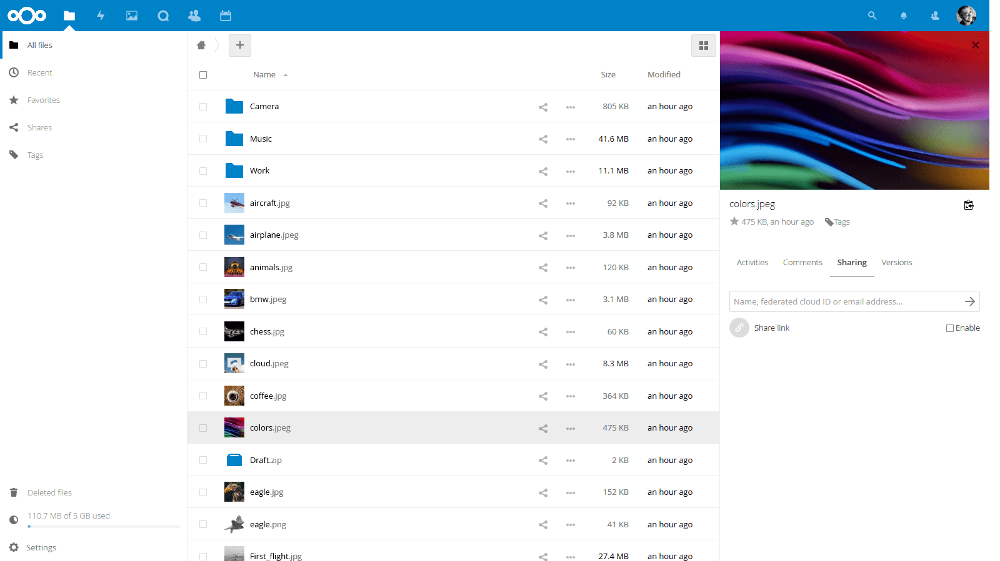

# Nextcloud CI/CD pipeline

Deploy Nextcloud with CI/CD on Elestio

 
 

# Once deployed ...

You can open Nextcloud here:

    URL: https://[CI_CD_DOMAIN]
    login: root
    password: [ADMIN_PASSWORD]

# Activate CRON jobs

Simplest way is to use CRON installed on the host instance, to configure it go to: https://[CI_CD_DOMAIN]/settings/admin
and select CRON option in the list

then connect over SSH to the VM and type:
    
    crontab -e

if asked for an editor to use, select 'nano' in the list
Once in the editor add this row at the end of the file

    */5 * * * * docker exec -u www-data [YOURPIPELINENAME]_app_1 php -f /var/www/html/cron.php

if your pipeline name is NC for example, it will be:
    
    */5 * * * * docker exec -u www-data NC_app_1 php -f /var/www/html/cron.php

In case of doubt you can find the exact container name with this command:

    cd /opt/app;
    docker-compose ps;
